# Database Schema

Implemented across four migrations in `supabase/migrations/`:

| Migration | What it adds |
|---|---|
| `..._initial_schema.sql` | The 16 tables from the original ER diagram, with RLS |
| `..._clubs_as_organisers.sql` | `club`, `club_representative`, and clubs as game post organisers |
| `..._game_participants_and_match_sides.sql` | The join flow, the game-to-match link, and sides |
| `..._audit_columns.sql` | `updated_at` / `updated_by` on every table that can change |

Access rules are documented separately in [rls-policies.md](./rls-policies.md),
which also lists the open questions this schema left unresolved.

## Conventions

- Lowercase `snake_case` identifiers, unquoted everywhere.
- `uuid` primary keys. `player.player_id` **is** the `auth.users` id, so a
  deleted auth user cascades the whole player record away.
- `timestamptz` for every point in time, never bare `timestamp`.
- Enum-like columns are `text` plus a `check` constraint rather than a Postgres
  `enum` type, so a later migration can add a value without `alter type`.
- Every foreign key column has an index. Postgres does not create these
  automatically, and without them both joins and cascading deletes fall back to
  sequential scans.
- Money and scores use `numeric`, never `float`.
- Every table that can change carries `updated_at` and `updated_by`, stamped by
  a trigger. See [Audit columns](#audit-columns) below.

## Entity relationships

Every entity carries `updated_at` and `updated_by` except `CLUB_REPRESENTATIVE`,
which has nothing to update. Both are stamped by a trigger and ignore anything
a client sends; `updated_by` is shown without an `FK` marker because it
deliberately is not one. See [Audit columns](#audit-columns) for why.

```mermaid
erDiagram
    PLAYER {
        uuid player_id PK "= auth.users.id"
        text display_name
        text self_rating_band
        boolean is_verified "service_role only"
        timestamptz joined_at
        timestamptz updated_at
        uuid updated_by
    }

    PLAYER_PROFILE {
        uuid player_id PK,FK
        text bio
        text suburb
        text state
        numeric reliability_score "service_role only"
        int games_played "service_role only"
        int no_show_count "service_role only"
        boolean is_discoverable
        timestamptz updated_at
        uuid updated_by
    }

    NOTIFICATION {
        uuid notification_id PK
        uuid player_id FK
        uuid match_id FK "nullable"
        text type
        text message
        boolean is_read
        timestamptz created_at
        timestamptz updated_at
        uuid updated_by
    }

    REPORT {
        uuid report_id PK
        uuid reported_by_player_id FK
        text target_type
        uuid target_id "polymorphic, no FK"
        text reason
        text status
        timestamptz created_at
        timestamptz updated_at
        uuid updated_by
    }

    GAME_POST {
        uuid post_id PK
        uuid organiser_id FK "set when a player posts"
        uuid organiser_club_id FK "set when a club posts"
        text format
        text suburb
        int player_limit "places, organiser included"
        timestamptz proposed_time
        text status
        timestamptz created_at
        timestamptz updated_at
        uuid updated_by
    }

    GAME_PARTICIPANT {
        uuid post_id PK,FK
        uuid player_id PK,FK
        text status "requested/accepted/rejected/withdrawn"
        timestamptz requested_at
        timestamptz responded_at
        timestamptz updated_at
        uuid updated_by
    }

    CLUB {
        uuid club_id PK
        text name
        text slug UK
        text description
        text suburb
        text state
        text contact_email
        text logo_url
        boolean is_verified "service_role only"
        uuid created_by FK
        timestamptz created_at
        timestamptz updated_at
        uuid updated_by
    }

    CLUB_REPRESENTATIVE {
        uuid club_id PK,FK
        uuid player_id PK,FK
        timestamptz added_at
    }

    ADMIN_POST {
        uuid admin_post_id PK
        uuid created_by FK
        text title
        text body
        text image_url
        int display_order
        text status
        timestamptz published_at
        timestamptz created_at
        timestamptz updated_at
        uuid updated_by
    }

    MINI_LEAGUE {
        uuid league_id PK
        uuid organiser_id FK
        text name
        timestamptz start_date
        timestamptz end_date
        text status
        timestamptz created_at
        timestamptz updated_at
        uuid updated_by
    }

    VENUE {
        uuid venue_id PK
        text name
        text address
        timestamptz created_at
        timestamptz updated_at
        uuid updated_by
    }

    LEAGUE_STANDING {
        uuid league_id PK,FK
        uuid player_id PK,FK
        int wins
        int losses
        int points
        int position
        timestamptz updated_at
        uuid updated_by
    }

    CANCELLATION_RECORD {
        uuid post_id PK,FK
        timestamptz cancelled_at
        text reason
        boolean is_no_show
        timestamptz updated_at
        uuid updated_by
    }

    MATCH {
        uuid match_id PK
        uuid post_id FK "the game it was played in"
        uuid league_id FK "nullable, casual matches"
        uuid venue_id FK "nullable"
        uuid created_by FK "added, see note 2"
        text format
        timestamptz played_at
        text suburb
        text status
        timestamptz created_at
        timestamptz updated_at
        uuid updated_by
    }

    CHECK_IN {
        uuid match_id PK,FK
        uuid player_id PK,FK
        timestamptz checked_in_at "renamed from timestamp"
        text method
        boolean verified "staff only"
        timestamptz updated_at
        uuid updated_by
    }

    MATCH_PARTICIPANT {
        uuid match_id PK,FK
        uuid player_id PK,FK
        text side "a or b"
        text status "playing/no_show/withdrawn"
        timestamptz updated_at
        uuid updated_by
    }

    MATCH_RESULT {
        uuid result_id PK
        uuid match_id FK
        text score
        text winning_side "a or b, not a player"
        uuid submitted_by FK "added, see note 3"
        text status
        timestamptz created_at
        timestamptz updated_at
        uuid updated_by
    }

    DISPUTE {
        uuid dispute_id PK
        uuid match_id FK
        uuid raised_by FK "added, see note 3"
        text reason
        text status
        timestamptz created_at
        timestamptz updated_at
        uuid updated_by
    }

    RANKING {
        uuid player_id PK,FK
        text format PK
        int ranking_points
        text band
        int verified_games_count
        timestamptz updated_at
        uuid updated_by
    }

    PLAYER ||--|| PLAYER_PROFILE : has
    PLAYER ||--o{ NOTIFICATION : receives
    PLAYER ||--o{ REPORT : files
    PLAYER ||--o{ GAME_POST : organises
    PLAYER ||--o{ ADMIN_POST : authors
    PLAYER ||--o{ MINI_LEAGUE : organises
    PLAYER ||--o{ LEAGUE_STANDING : tracks
    PLAYER ||--o{ RANKING : holds
    PLAYER ||--o{ CHECK_IN : checks_in
    PLAYER ||--o{ MATCH_PARTICIPANT : plays_in
    PLAYER ||--o{ MATCH : creates
    PLAYER ||--o{ CLUB : registers
    PLAYER ||--o{ CLUB_REPRESENTATIVE : represents_as
    PLAYER ||--o{ GAME_PARTICIPANT : requests_to_join
    CLUB ||--o{ CLUB_REPRESENTATIVE : is_represented_by
    CLUB ||--o{ GAME_POST : organises
    GAME_POST ||--o{ GAME_PARTICIPANT : receives
    GAME_POST ||--o{ MATCH : contains
    MINI_LEAGUE ||--o{ LEAGUE_STANDING : maintains
    GAME_POST ||--o| CANCELLATION_RECORD : may_incur
    MINI_LEAGUE ||--o{ MATCH : hosts
    VENUE ||--o{ MATCH : hosts
    MATCH ||--o{ NOTIFICATION : reminds
    MATCH ||--o{ CHECK_IN : verified_by
    MATCH ||--o{ MATCH_PARTICIPANT : includes
    MATCH ||--o{ MATCH_RESULT : produces
    MATCH ||--o{ DISPUTE : may_raise
```



## The game lifecycle

This is the spine of the app, so it is worth reading in order.

```
game_post              "doubles at Box Hill, Saturday, 4 places"
  |
  +-- game_participant     players ask to join; the organiser accepts or rejects
  |                        the accepted rows are the roster
  |
  +-- match                one or more matches played within that game
        |
        +-- match_participant   drawn from the roster, each on side a or b
        |
        +-- match_result        score, and which side won
```

**A game is not a match.** One Saturday session is one `game_post` and usually
several `match` rows: you rotate partners, you play best of three, you swap
courts. `match.post_id` is what ties them together, and it is nullable so league
fixtures and one-off matches still work.

**The roster gates the matches.** A player can only appear in a match if they
are an `accepted` participant of that game. This is enforced by the
`match_participant_validate` trigger, not by the frontend, so it holds even if
someone drives the API directly.

**Sides, not players, win matches.** `match_participant.side` is `a` or `b`, and
`match_result.winning_side` names one of them. A `winner_id` pointing at a
single player cannot express a doubles win, which is why that column is gone.

Three rules are enforced by triggers because they count other rows, which a
check constraint cannot do:

| Trigger | Rule |
|---|---|
| `game_participant_capacity` | A game cannot accept more players than `player_limit` |
| `match_participant_validate` | Players must be on the roster; one per side for singles, two for doubles |
| `match_completion_validate` | A match cannot be marked `completed` with sides that are not full |

Sides may be filled one player at a time, so the "exactly N per side" rule is
only applied at completion, when it has to hold.

## Audit columns

Every table that can change carries two columns:

| Column | Meaning |
|---|---|
| `updated_at` | When the row last changed. `timestamptz`, never null, defaults to `now()` |
| `updated_by` | The player who made that change. Null means it came from `service_role`, so a backend job rather than a person |

**Both are set by a trigger, never by the client.** `set_updated_metadata` runs
before every insert and update. A client that sends its own `updated_by` is
ignored, which matters because a status field recording who changed it is
worthless if the person changing it picks the value.

The trigger skips rows where nothing but the audit columns changed, so a `PATCH`
that writes a column the value it already held does not make the row look
freshly edited.

`club_representative` is the one table without them: it has no updatable column,
only inserts and deletes.

**`updated_by` is not a foreign key**, which is a deliberate trade against the
grain. Two reasons:

- PostgREST resolves embeds through foreign keys. A second key from, say,
  `game_participant` to `player` makes `player(display_name)` ambiguous, and
  every embed in the app would have to be written `player!player_id(...)`. The
  audit column appears on rare detail screens; the roster is read constantly.
- The trigger is the only writer and it takes the value from `auth.uid()`, so
  the column cannot hold anything but a real user id. A constraint that no
  writer can violate protects nothing.

The cost is that deleting a player leaves their id behind in `updated_by`, and
it will not join to anything. For an audit trail that is arguably right: the
edit did happen, and it was them.

## Embedding the organiser: a gotcha

`game_participant` gives `game_post` a second path to `player` (many-to-many
through the join table) on top of the direct `organiser_id` foreign key. So this
now fails with `PGRST201`, "more than one relationship was found":

```js
supabase.from('game_post').select('*, player(display_name)')   // ambiguous
```

Say which link you mean with `!`, and alias it to something readable with `:`

```js
supabase.from('game_post').select(`
  post_id, player_limit, status,
  organiser:player!organiser_id(display_name),
  club(name, logo_url),
  game_participant(status, player(display_name))
`)
```

That returns the post, whichever organiser applies (the other is null), and the
full roster in one round trip. There is a test covering exactly this query.

Two details worth knowing:

- The hint after `!` can be **the column name** (`organiser_id`) or the
  constraint name (`game_post_organiser_id_fkey`). Both work. Prefer the column
  name: it is shorter, it is the thing you mean, and it does not break
  if someone renames a constraint.
- `player(display_name)` still works *inside* `game_participant`, because from
  there the route is unambiguous again.

**Do not scatter this across the codebase.** Write the query once in a data
access function and call that from the components. The disambiguation is easy
to forget, the failure only appears at runtime, and any new foreign key to
`player` can make a previously fine query ambiguous. One place to fix beats
twenty.

## Notes on the tables

**`player` / `player_profile`** are split so the hot path (name and rating band,
read on every listing) stays narrow, while optional profile text sits in its own
row. Both rows are created automatically by the `on_auth_user_created` trigger
when someone signs up; the client never inserts them.

**`mini_league.organiser_id`** uses `on delete restrict`, not `cascade`. Deleting
a player must not silently delete a league other people are playing in; reassign
the organiser first.

**`match.league_id` is nullable.** A casual match arranged through a game post
belongs to no league.

**A game post is organised by exactly one of a player or a club.** Rather than
one polymorphic column holding either kind of id, there are two nullable
columns with real foreign keys, and a check constraint
(`num_nonnulls(organiser_id, organiser_club_id) = 1`) guaranteeing exactly one
is filled in. This keeps referential integrity in the database and, just as
importantly, lets PostgREST embed the organiser in a single request:

```js
supabase.from('game_post').select('*, player(display_name), club(name, logo_url)')
```

That nested syntax works only because a foreign key exists. The unused side
comes back `null`. With a polymorphic column, every listing would need a second
and third round trip to resolve organiser names.

**`club` is not an account.** A club cannot log in. Real people post on its
behalf, and `club_representative` lists which player accounts may do so. That
table is deliberately *not* a membership roster: being a representative says
nothing about playing for the club. Whoever registers a club becomes its first
representative automatically, via the `on_club_created` trigger, so a club can
never exist with nobody able to speak for it.

**`match_result` allows several rows per match**, read from the diagram as "each
side submits a score and one gets confirmed". A partial unique index enforces at
most one `confirmed` result per match, and a check constraint stops a result
being confirmed without a `winning_side`.

**The organiser of a game joins it automatically.** When an individual posts a
game, the `on_game_post_created` trigger adds them to the roster as `accepted`,
taking one of the places. "A game of 4" therefore means four people on court
including the organiser. A club post has no such person, so all places are open.

**`report.target_id` is polymorphic**, interpreted according to `target_type`,
so Postgres cannot enforce a foreign key. Application code must check the target
exists.

**`ranking` and `league_standing` are derived**, recalculated from confirmed
results. Nothing computes them yet.

## Differences from the original ER diagram

| # | Change | Reason |
|---|---|---|
| 1 | `game_post.group_id` replaced by `organiser_club_id`, plus new `club` and `club_representative` tables | The diagram defined no `GROUP` entity. Clubs and organisations need to post listings too |
| 2 | Added `match.created_by` | A casual match has no league organiser, so RLS had no way to say who may edit it |
| 3 | Added `match_result.submitted_by`, `dispute.raised_by` | Needed to show who claimed what, and to let a player see the dispute they raised |
| 4 | Added `notification.match_id` | Implied by `MATCH ||--o{ NOTIFICATION : reminds` |
| 5 | Added `game_participant`, `game_post.player_limit`, `match.post_id` | The diagram had no join flow and no link from a match back to the game it was played in |
| 6 | Added `match_participant.side` | A doubles match could not say who partnered whom |
| 7 | Replaced `match_result.winner_id` with `winning_side` | A single player id cannot express a doubles win |
| 8 | `reliability_score` is `numeric(5,2)`, not float | Exact decimals keep leaderboard ordering deterministic |
| 9 | `check_in.timestamp` renamed `checked_in_at` | `timestamp` is a SQL type name and reads ambiguously |
| 10 | Added `created_at` to most tables | Conventional, and needed for any "recent activity" view |
| 11 | Added `updated_at` / `updated_by` to all 18 changeable tables | Anything with a `status` needs to record who moved it and when |

The first three want a decision from the team. See the open questions in
[rls-policies.md](./rls-policies.md).

## Working with it locally

```bash
supabase start                  # bring up the local stack (needs Docker running)
supabase db reset --local       # drop and rebuild from migrations + seed.sql
supabase db advisors --local    # security and performance lint
./supabase/tests/rls_test.sh    # 68 access-control and integrity checks

supabase migration new <name>   # start a new change
supabase db push                # apply pending migrations to the linked project
```

Studio runs at http://127.0.0.1:54323 once the stack is up.

Nothing has been pushed to the hosted project yet; it is still empty.
